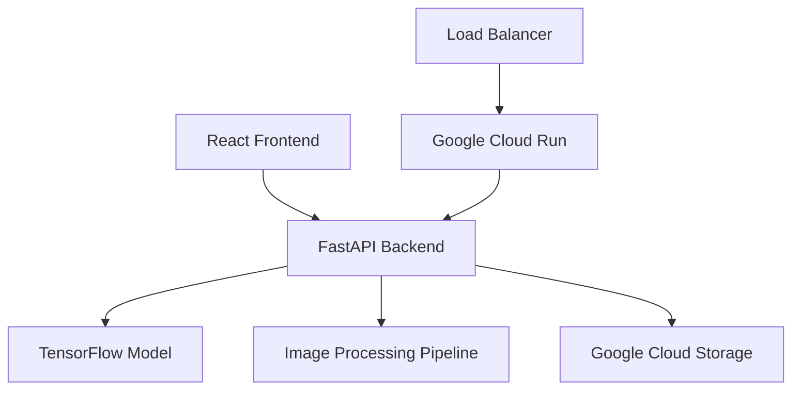

# Design Document

## Overview

The AI Image Caption Generator is a full-stack deep learning application that combines computer vision and natural language processing to automatically generate descriptive captions for uploaded images. The system uses a CNN + LSTM architecture implemented in TensorFlow, deployed as a FastAPI backend on Google Cloud, with a React frontend for user interaction.

## Architecture

### High-Level Architecture



### System Components

1. **Frontend Layer**: React-based web application for user interaction
2. **API Layer**: FastAPI backend handling requests and responses
3. **ML Pipeline**: TensorFlow CNN + LSTM model for caption generation
4. **Storage Layer**: Google Cloud Storage for temporary image storage
5. **Deployment Layer**: Google Cloud Run for scalable containerized deployment

## Components and Interfaces

### Frontend Components (React)

#### ImageUploader Component
- **Purpose**: Handle image file selection and upload
- **Props**: `onImageUpload(file)`, `maxFileSize`, `acceptedFormats`
- **State**: `selectedImage`, `isUploading`, `uploadProgress`
- **Methods**: `validateFile()`, `handleFileSelect()`, `uploadImage()`

#### ImagePreview Component
- **Purpose**: Display uploaded image with generated caption
- **Props**: `imageUrl`, `caption`, `isLoading`
- **State**: `imageLoaded`
- **Methods**: `handleImageLoad()`, `handleImageError()`

#### CaptionDisplay Component
- **Purpose**: Show generated caption with formatting
- **Props**: `caption`, `confidence`, `isLoading`
- **State**: `displayText`
- **Methods**: `animateText()`, `copyToClipboard()`

### Backend Components (FastAPI)

#### API Endpoints

```python
# Main endpoints
POST /api/v1/generate-caption
GET /api/v1/health
GET /api/v1/model-info
```

#### CaptionService Class
- **Purpose**: Orchestrate the caption generation process
- **Methods**: 
  - `generate_caption(image_data: bytes) -> CaptionResponse`
  - `validate_image(image_data: bytes) -> bool`
  - `preprocess_image(image_data: bytes) -> np.ndarray`

#### ModelManager Class
- **Purpose**: Handle TensorFlow model loading and inference
- **Methods**:
  - `load_model() -> tf.keras.Model`
  - `predict(image_array: np.ndarray) -> str`
  - `extract_features(image: np.ndarray) -> np.ndarray`

#### ImageProcessor Class
- **Purpose**: Handle image preprocessing and validation
- **Methods**:
  - `resize_image(image: PIL.Image, target_size: tuple) -> PIL.Image`
  - `normalize_image(image_array: np.ndarray) -> np.ndarray`
  - `validate_format(image_data: bytes) -> bool`

### ML Model Architecture

#### CNN Feature Extractor
- **Base Model**: Pre-trained ResNet50 or InceptionV3
- **Purpose**: Extract visual features from images
- **Output**: Feature vector (2048 dimensions)
- **Modifications**: Remove top classification layer, add global average pooling

#### LSTM Caption Generator
- **Architecture**: Multi-layer LSTM with attention mechanism
- **Input**: CNN features + word embeddings
- **Output**: Sequence of words forming natural language caption
- **Vocabulary**: 10,000 most common words from training dataset

#### Model Pipeline
```python
# Simplified model architecture
image_input = Input(shape=(224, 224, 3))
cnn_features = cnn_model(image_input)
lstm_input = RepeatVector(max_caption_length)(cnn_features)
lstm_output = LSTM(512, return_sequences=True)(lstm_input)
caption_output = Dense(vocab_size, activation='softmax')(lstm_output)
```

## Data Models

### Request/Response Models

```python
class CaptionRequest(BaseModel):
    image_data: str  # Base64 encoded image
    max_length: Optional[int] = 20
    temperature: Optional[float] = 1.0

class CaptionResponse(BaseModel):
    caption: str
    confidence: float
    processing_time: float
    image_id: str

class ErrorResponse(BaseModel):
    error: str
    message: str
    timestamp: datetime
```

### Internal Data Models

```python
class ImageMetadata(BaseModel):
    width: int
    height: int
    format: str
    size_bytes: int
    upload_timestamp: datetime

class ModelPrediction(BaseModel):
    raw_output: List[float]
    decoded_caption: str
    confidence_scores: List[float]
    feature_vector: List[float]
```

## Error Handling

### Frontend Error Handling
- **File Validation Errors**: Display user-friendly messages for invalid file types/sizes
- **Network Errors**: Show retry options and connection status
- **API Errors**: Parse backend error responses and display appropriate messages
- **Loading States**: Provide visual feedback during processing

### Backend Error Handling
- **Input Validation**: Validate image format, size, and content
- **Model Errors**: Handle TensorFlow model loading and inference failures
- **Resource Limits**: Implement timeouts and memory management
- **Logging**: Comprehensive error logging with structured format

### Error Response Format
```python
{
    "error": "INVALID_IMAGE_FORMAT",
    "message": "Supported formats: JPEG, PNG, WebP",
    "timestamp": "2024-01-15T10:30:00Z",
    "request_id": "uuid-string"
}
```

## Testing Strategy

### Unit Testing
- **Frontend**: Jest + React Testing Library for component testing
- **Backend**: pytest for API endpoint and service testing
- **Model**: TensorFlow testing utilities for model validation

### Integration Testing
- **API Integration**: Test complete request/response cycle
- **Model Integration**: Validate CNN + LSTM pipeline
- **Cloud Integration**: Test deployment and scaling behavior

### End-to-End Testing
- **User Workflows**: Automated browser testing with Playwright
- **Performance Testing**: Load testing with realistic image datasets
- **Manual Verification**: Step-by-step validation as specified in requirements

### Test Data Strategy
- **Sample Images**: Curated dataset of various image types and complexities
- **Expected Captions**: Ground truth captions for accuracy validation
- **Edge Cases**: Invalid files, corrupted images, extreme sizes

## Deployment Architecture

### Google Cloud Components
- **Cloud Run**: Containerized FastAPI backend with auto-scaling
- **Cloud Storage**: Temporary image storage and model artifacts
- **Cloud Build**: CI/CD pipeline for automated deployments
- **Cloud Monitoring**: Application performance and error tracking

### Container Configuration
```dockerfile
# Multi-stage build for optimized image size
FROM python:3.9-slim as base
# Install TensorFlow and dependencies
# Copy application code
# Configure production settings
```

### Environment Configuration
- **Development**: Local development with hot reload
- **Staging**: Cloud deployment for testing and validation
- **Production**: Optimized deployment with monitoring and scaling

## Security Considerations

### Input Validation
- File type and size restrictions
- Image content validation to prevent malicious uploads
- Rate limiting to prevent abuse

### Data Privacy
- No permanent storage of uploaded images
- Automatic cleanup of temporary files
- No logging of image content or personal data

### API Security
- CORS configuration for frontend access
- Request size limits and timeouts
- Health check endpoints for monitoring